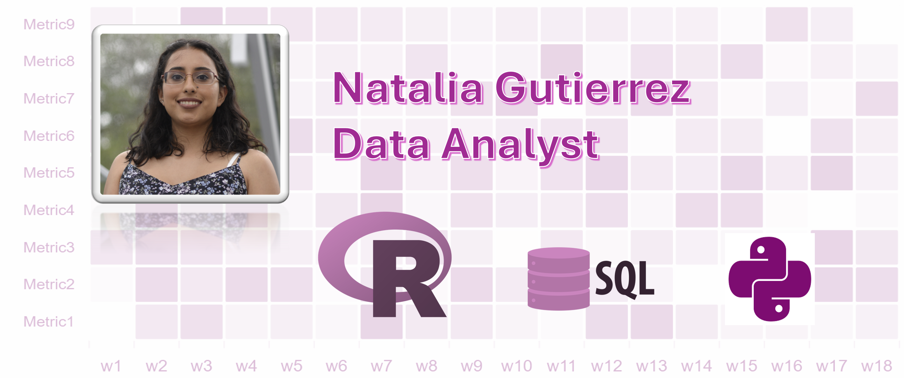

<h1 align="center">Hi 👋, I'm Natalia Gutierrez</h1>
<h3 align="center">A passionate Data Analyst in Brussels</h3>

About me
----------------------

Analytical and detail-oriented data analyst with a strong background in scientific research. Capable of managing, cleaning, and interpreting complex datasets using Python (pandas, numpy, and SciPy), SQL, R, and Excel. Skilled in data visualisation (Tableau) and communicating insights to technical and non-technical audiences. Eager to apply problem-solving abilities to support evidence-based decision making in dynamic, collaborative environments.

## My skills:

        

<h3 align="left">Connect with me:</h3>

